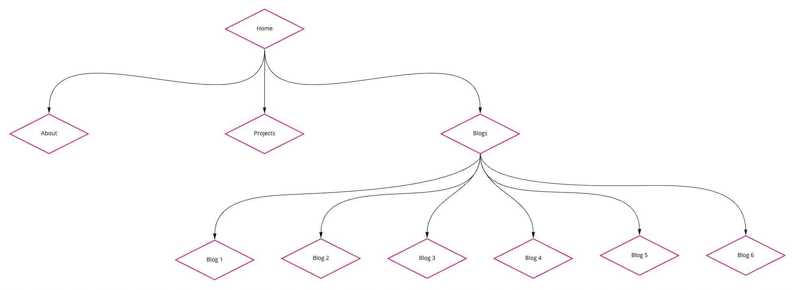
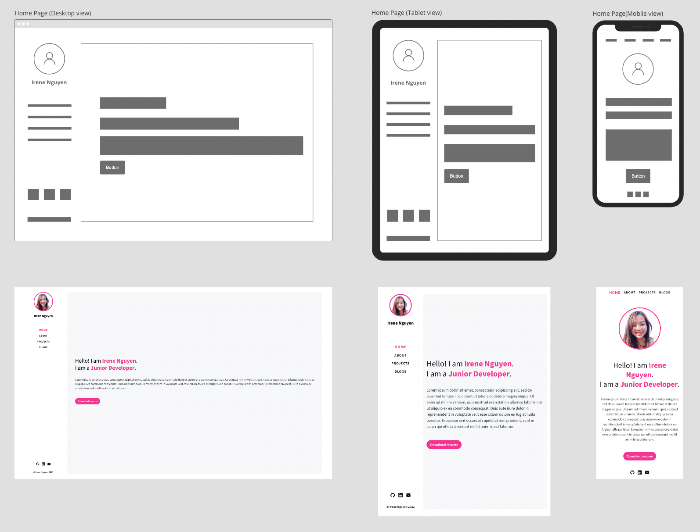
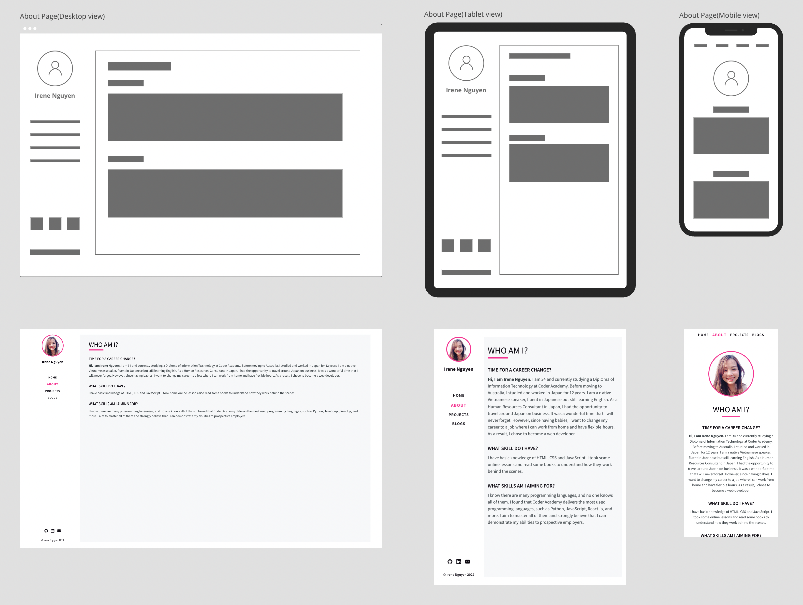
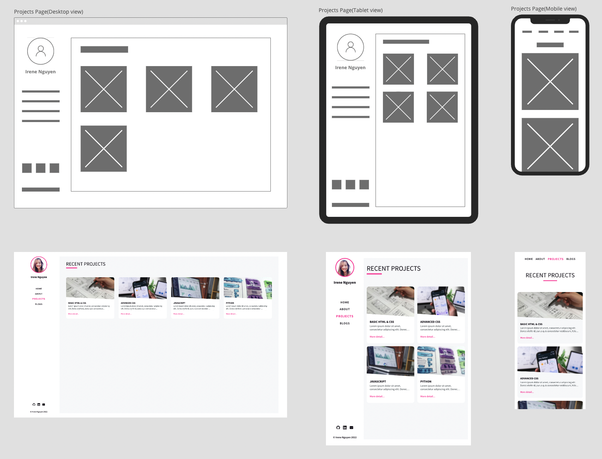
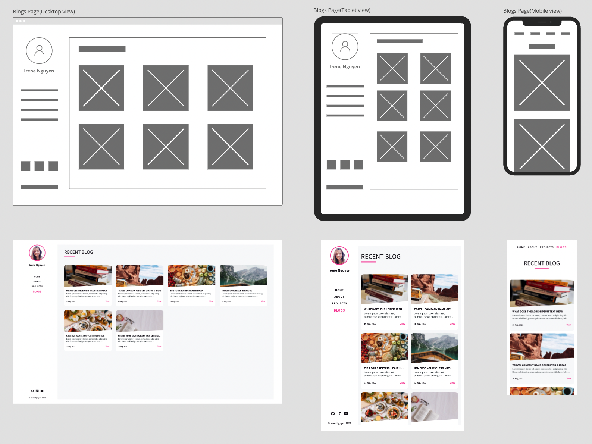
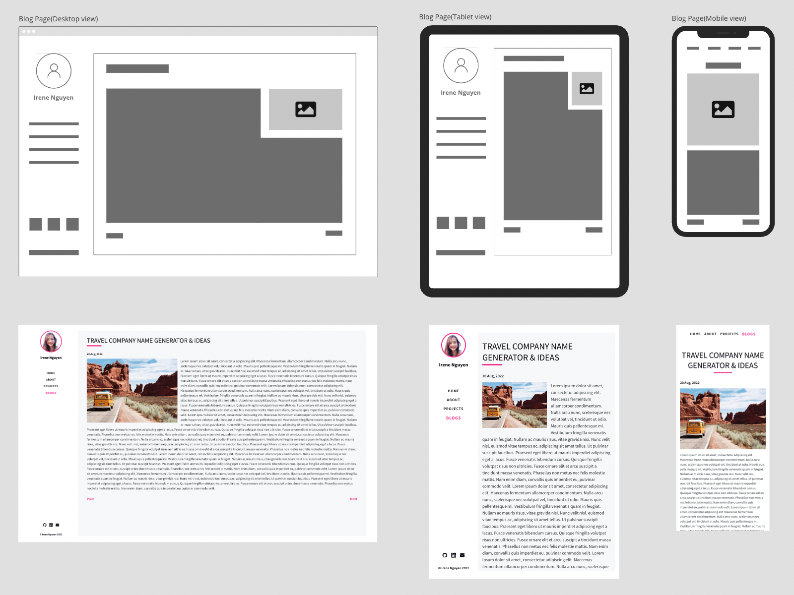

# Irene Nguyen's Portfolio

[Portfolio Website] (https://irenenguyen1017.github.io/portfolio/)

[Github Repo] (https://github.com/irenenguyen1017/portfolio)

==========================

## Purpose

The purpose of this website is to showcase my skills as a junior web developer to prospective employers. I have tried to use all my current to create an attractive website that is accessible to all responsive layouts.

## Functionality / Features

The website has a simple layout and doesn't use too many colours. However, it runs smoothly on different devices. I also added some animations to make the site more attractive. All pages have sidebar menu that navigates audience to other pages and links to my social accounts.

- Homepage: Includes my portrait, name, greeting, brief introduction and a link to a resume at the end.
- About me: Telling more details about personal story.
- Projects: Listed my projects and the links to my repositories in github.com.(Will be added later).
- Blogs: Linking to different blogs, a familiar link to the previous or next blog at the end of each blog.
  
## Sitemap



## Mockups / Screenshots

> Home Page



> About Page



> Projects Page



> Blog Detail Page



> Blog Detail Page



## Target audience

I want to show my website to hiring managers who are looking for a new aspiring web developer. It will be a strong proof to make a good impression and be the first step towards getting a job in the IT field.

## Built with

- HTML5 & CSS3
- Sass (styling)
- Node sass, Postcss and Autoprefixer(compiling & prefixing css)
- Responsive design
- Miro board (sitemap)
- Npm package with Yarn
- Github Pages (deployment)

## Get started

> Clone repository

```bash
git clone git@github.com:irenenguyen1017/portfolio.git
```

> Install dependencies

```bash
cd portfolio & yarn install
```

> Start local server

```bash
yarn start
```

And open `localhost:8080` to view it in the browser

> Build production

```bash
yarn build
```
