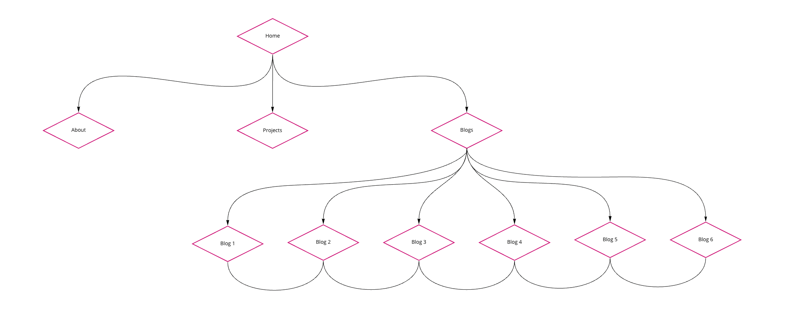

# Irene Nguyen's Portfolio

[Portfolio Website](https://irenenguyen1017.github.io/portfolio/)

[Github Repo](https://github.com/irenenguyen1017/portfolio)

[Presentation](https://vimeo.com/743835435)

==========================

## Purpose

The purpose of this website is to showcase my skills as a junior web developer to prospective employers. I have tried to use all my current to create an attractive website that is accessible to all responsive layouts.

## Functionality / Features

The website was built with responsive design. It has five main pages which are listed below:

- Homepage: Displaying my introduction and a link to download the resume.
- About me: Showing more information about me and my skills.
- Projects: Listing my recent projects which have a link to each project.
- Blogs: Displaying a list of my recent blogs which are linked to a detail blog page.
- Blog detail: Showing the blog detail.
  
## Sitemap



## Mockups / Screenshots

> Home Page


> About Page


> Projects Page


> Blog Detail Page


> Blog Detail Page


## Target audience

I want to show my website to hiring managers who are looking for a new aspiring web developer. It will be a strong proof to make a good impression and be the first step towards getting a job in the IT field.

## Built with

- HTML5 & CSS3
- Sass (styling)
- Node sass, Postcss and Autoprefixer(compiling & prefixing css)
- Responsive design
- Miro board (sitemap)
- Npm package with Yarn
- Github Pages (deployment)

## Get started

> Clone repository

```bash
git clone git@github.com:irenenguyen1017/portfolio.git
```

> Install dependencies

```bash
cd portfolio & yarn install
```

> Start local server

```bash
yarn start
```

And open `localhost:8080` to view it in the browser

> Build production

```bash
yarn build
```
